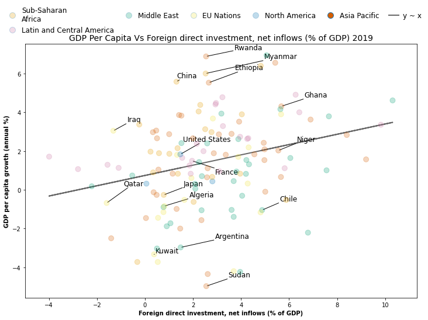
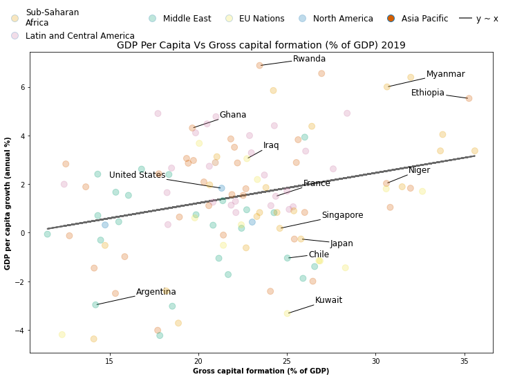

# Natnaiel’s Portfolio

## [**Project 1: World Bank API Visualization**](https://github.com/Natnaiel98/World-Bank-API-Visualization)
- Created a function that retrieves relevant economic variables from the World Bank API and produces a visualization that compares the selected indicator with the GDP per Capita growth rate for all nations with available data in a selected year.
- The variables selected for analysis are based on a large body of literature regarding the determinants of economic growth. Some of the variables that have been found to have a strong relationship with the growth rate of a nation are Foreign Direct Investments (Inflows or Outflows), Imports/Exports, Inflation, and Capital Growth Formation.
- The function allows a user to input the independent variable to analyze, and the year of analysis. The function pulls data from the World Bank API, wrangles it and produces a scatterplot and regression line that plots the relationship between the annual GDP per Capita growth rate and the selected indicator.

- These two visualizations display that the Foreign Direct Currency Inflows and especially the Gross Capital Formation had a positive correlation with a country's annual GDP per Capita Growth rate in 2019.

## [**Project 2:AFCON-Group Disparity**](https://github.com/Natnaiel98/AFCON-Group-Disparity)

- Soccer fans are quick to complain about the luck of the draw during tournaments. Ethiopian National Team fans were aggrieved by the strength of the group that they were drawn into in the 2021 African Cup
  of Nations Tournament(AFCON). 
- To see if these complaints were valid, I analyzed how equally distributed each group in the African Cup of Nations (AFCON) soccer tournament was in terms of team strength.
- Each group in an AFCON tournament is comprised of four teams. Each team in a group is selected from a separate 'pot'. Teams are grouped into a pot based on a National team ranking and past tournament performances. Pot 1 contains the strongest teams, followed by Pot 2 and so forth. This in theory ensures that all groups have the same relative strength of teams. 
- Team strength was determined by using the national world rankings of the teams comprising these groups at the time of the tournament.
- Data was mined from two sources: the Transfermarkt website was used to get the National team standings at the time of a tournament and Wikipedia was used to obtain the group composition of the AFCON tournaments held.

**This figure shows us that the group that the Ethiopian National Team belonged to (Group A) was not unusually difficult in terms of the average rank. However, this measure could be skewed by very strong first and second-pot teams. The threshold for progressing through to the next round is finishing third and above. So let us look at the difference in rank between the Pot 3 and Pot 4 teams in each group.**

**This figure on the other hand displays that the Ethiopian National Team did indeed face an uphill battle as it faced the by far largest gap in strength with the next weakest team in its group (60 places).**

## [**Project 3:Ethiopian-Premier-League Tables**](https://github.com/Natnaiel98/Ethiopian-Premier-League-Statistic-Tables)
- Analysis of interesting statistics and trends that have developed in the Ethiopian Premier League soccer tournament from 1999-2021.
- Data on the league positions, points, goals scored and conceded were obtained from the Rec.Sport.Soccer Statistics Foundation (RSSSF) for the 1999-2021 time period.
- Cleaned and merged this data in order to perform data exploration and produce visualizations.

  **Teams that have scored the highest Goals per 90 minutes(GF90)**
  

 **Teams that have scored the lowest Goals per 90 minutes(GF90)**
 

## [**Project 4: Fullback_Heatmap**](https://github.com/Natnaiel98/Fullback_Heatmap)
- One of the major tactical shifts in the sport of Soccer is the evolution of what is called the "Fullback" position. Traditionally, fullbacks have been trained to provide mainly defensive but also offensive support on the flanks of the pitch. Since the mid-2010s, more and more managers are instructing their fullbacks to "invert" and drift to more central areas of the pitch in order to win the midfield battle.
- The following function allows a user to visualize the difference in how teams set up their fullbacks at the 2018 FIFA Men's World Cup tournament. The function accepts the name of a National Team that particpated in the tournament as an input and outputs a heatmap of the activities of all of that team's fullbacks for players that were involved in at least 50 actions over the course of the tournament.

**The first two heatmaps are of Croatian fullbacks Sime Vrsaljko and Ivan Strinic and show us that these players have been utilized as traditional fullbacks that spend most of their time at the edge of the pitch.**

**Eventual champions Germany on the other hand, played fullbacks Julian Brandt and Jonas Hector, who often drifted centrally.**

