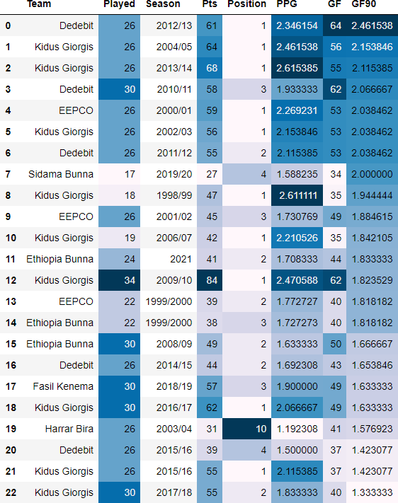
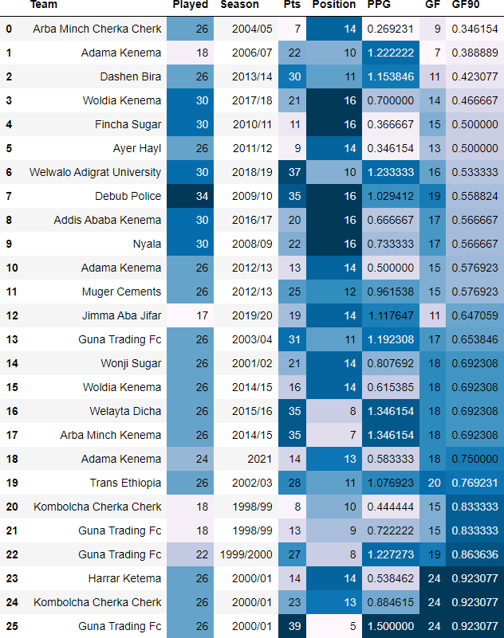

# Natnaiel’s Portfolio

[**Project 1: World Bank API Visualization**](https://github.com/Natnaiel98/Fullback_Heatmap)
- Produced a function that retrieves leading economic indicator variables from the World Bank API and produces a visualization that compares the selceted indicator with the GDP per Capita growth rate for a selected year.
- There has been a vast amount of literature in regards to economic determinants of growth. Some of the variables that have been found to have strong relationship with the growth rate of a nation are: Foreign Direct Investments( Inflows or Outflows), Imports/Exports, Inflation, and Capital Growth Formation.
- The function that I have created allows a user to input the type of variable to analyze, and the year of analysis. The function then pulls data from the World Bank API, wrangles this data and produces a visualization that explores the relationship between GDP per Capita growth and the selected indicator.

[**Project 2: Fullback_Heatmap**](https://github.com/Natnaiel98/Fullback_Heatmap)
- Produced  a function that returns a Fullback's heat map for Statbomb's 2018 Men's World Cup Soccer tournament.
- One of the recent major trends in Soccer is the evolution of the FullBack position. Traditionally, fullbacks have been deployed to stay near the sideline of the pitch but Managers are now  increasingly been instructing fullbacks to drift to more central areas of the pitch. 
- The function that I have created allows a user to visualize the difference in how teams set up their fullbacks over the course of the 2018 World Cup. The function accepts the name of a National Team as an input and outputs a heatmap with all of the actions performed by the team's fullbacks over the course of the tournament. The function only returns heatmaps for players with more than 50 event actions.
- The following visualizions display a contrast in bullback play styles. The first two heatmaps are of Croatian fullbacks Sime Vrsaljko and Ivan Strinic and show us that these players have been utilized as traditional fullbacks that spend most of their time at the edge of the pitch:

- Eventual champions Germany on the other hand, played fullbacks Julian Brandt and Jonas Hector, which often drifted centrally:

[**Project 3:Ethiopian-Premier-League Tables**](https://github.com/Natnaiel98/Ethiopian-Premier-League-Statistic-Tables)
- Produced tables and visualizations to uncover trends and interesting statistics in regards to the Ethiopian Premier League soccer tournament from 1999-2021.
- Obtained data from the Rec.Sport.Soccer Statistics Foundation (RSSSF) database for the data on the Ethiopian Premier League standings for the 1999-2021 time period.
- Cleaned and merged this data in order to perform data exploration.
- Produced tables and visualizations in order to present striking statistics and trends that have been witnessed in the league over the past 20 years.

  **Teams that have scored the highest Goals per 90 minutes(GF90)**
  

 **Teams that have scored the lowest Goals per 90 minutes(GF90)**
 

[**Project 4:AFCON-Group Disparity**](https://github.com/Natnaiel98/AFCON-Group-Disparity)

- Analyzed how equally distributed each group in the African Cup of Nations (AFCON) soccer tournament in terms of team strength.
- Team strength was detertmined using the National world rankings of the teams comprising these groups.
- Data was obtained from two sources: Transfermarkt for the National team standings at the time of a tournament and Wikipedia for the group composition for all tournaments held.
- Different measures to calculate potential inequalities in the strengths of teams distributed among the different groups. Different visualizations were produced to display these inequality between the groups.

